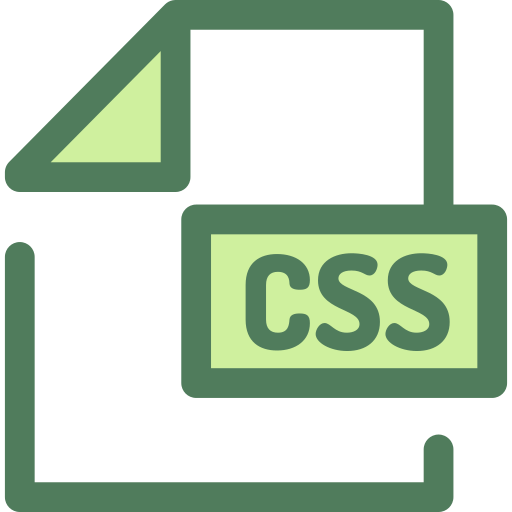

## 🎥  Preview site :arrow_right: [clickHere](https://szymonrojek.github.io/to-do-list-app/)

## Description:
This is a simple To-Do list application - helps to organize our daily tasks. Use it to capture and organize tasks the moment they pop into your head. 

## Technologies:

<table>
  <tr>
    <td></td>
    <td></td>
    <td></td>
    <td></td>
  </tr>
</table>
<table>
  <tr>
    <td></td>
    <td> </td>
    <td></td>
  </tr>
 </table>


## I have used:
- Semantic HTML
- BEM methodology
- Responsive Web Design
- Mobile first
- ES6+

## Usage:

1. To start development and server
```
npm run dev
```
2. Build version
```
npm run build
```

3. Dist & gh-pages
```
npm run deploy
```